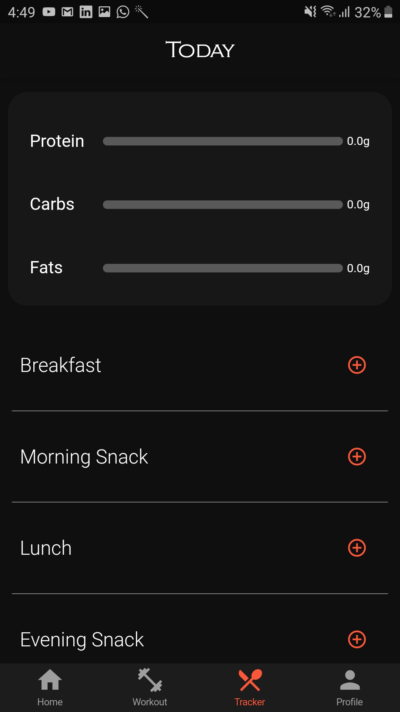

# fitnet

A new Flutter project.

## Getting Started

This project is a starting point for a Flutter application.

A few resources to get you started if this is your first Flutter project:

- [Lab: Write your first Flutter app](https://flutter.dev/docs/get-started/codelab)
- [Cookbook: Useful Flutter samples](https://flutter.dev/docs/cookbook)

For help getting started with Flutter, view our
[online documentation](https://flutter.dev/docs), which offers tutorials,
samples, guidance on mobile development, and a full API reference.

# About fitnet
Fitnet is a fitness app with the following features:

1. You get a bunch of workouts to choose from according to your fitness goals.
2. You get the sets,reps and the description of how to do your worokout.
3. You also get an in app tutorial of how to do the workout
4. You can also track the amount of calories that you have consumed.
5. You can specifically keep track of the amount of proteins,carbs and proteins that you have consumed throughout the day.
6. You also have the option to select your favourite recipe(both health and unhealthy) from the bunch of recipes that you want to cook for your cheat meal.

The Tech stack that has been used for this project is:

1. Flutter
2. Firebase database
3. Firestore
4. Firebase authentication
5. Firebase storage

# How the app looks

1. Landing Page                                                                          

2. Registration Page
 

3. Sign In Page
 

4. Entering user details after registration
 

5. User details 
 

6. Set target Weight after registration
 

7. Setting the intensity of the respective weight goal
 

8.  Weight goal set
 

9. Maintenance calories calculated
 

10. Home page
 
 
 

11. Body Goals
 

12. Workout Programs
 

13. Weeks List
 

14. Workout
 

15. Workout Video
 

16. Calorie Tracker
 

17. Calorie Tracker Search
 

18. Calorie Tracker Food
 

19. Calorie Tracker after adding food
 
 

20. Calorie Tracker Food removing functionality
 

21. Home page after adding food
 

22. Recipe Search 
 

23. Recipe
 

24. User Profile
 
 

25. User Profile Edit
 
